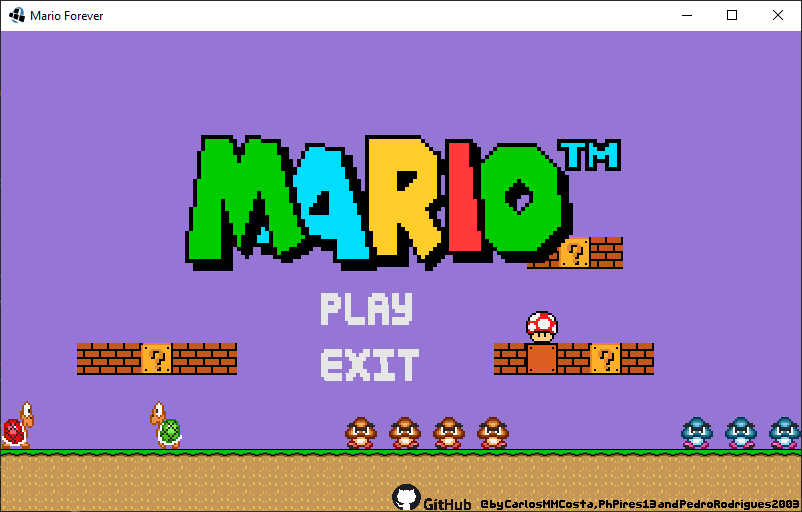
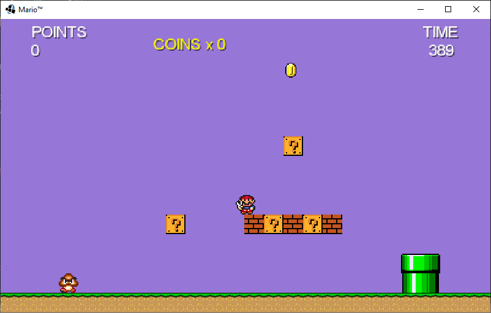

# MARIO MAKER

  
  

---
## Description
- Adaptation of the Nintendo game Super Mario Maker, from Nintendo Switch.
- In Java 15, using Object-Oriented Programming and the graphical library LibGDX.
- Practical work for the class LLP2 of informatics course in CEFET-MG.

---
## How to play
- The player can interact with the screen using the mouse and keyboard.
- The player controls Mario and has to pass challenges to complete the level and save the princess.
- Using the arrow keys to move and the space bar to jump.

### Points
- Killing enemies or stopping the shell give 100 points.
- Breaking a brick gives 50 points.
- Each coin gives 200 points.

---
## Map Creator
- It is possible to create maps using a simple text file.
- Each line determine a component of the map
- The line has the following composition: ``<?pre_argument>`` ``<item>`` ``<coordinates>`` ``<?post_argument>``
  - ``<item>`` is the item to be placed in the map (Brick, Ground, LuckyBlock, Coin, Goomba, Koopa, Pipe).
  - ``<coordinates>`` is the position of the item in the map ``<x>`` ``<y>``.
  - ``<?pre_argument>`` define the structure to be created of the item.
  - ``<post_argument>`` some of the items or the structures needs custom arguments.

- Rules:
  - ``Wall``: creates a wall of the item
    - coordinates: ``<x>`` ``<y_start>`` ``<y_end>``
  - ``Floor``: creates a floor of the item
    - coordinates: ``<x_start>`` ``<x_end>`` ``<y>``
  - ``Stairs``: creates a stairs of the item
    - coordinates: ``<x_start>`` ``<x_end>`` ``<y>``
    - post_argument: up or down: ``U``, ``D``
  - ``Pipe``: creates 2 connected pipes
    - coordinates: ``<x_first>`` ``<y_first>`` ``<x_second>`` ``<y_second>``
  - ``Goomba`` and ``Koopa``: creates an enemy
    - post_argument: direction to walk when spawned: ``R``, ``L``

---
## How to execute
- The final version of the game is ready to play in the ``Mario.jar`` file in the project root.

---
## Structure
- ### Folders
  - The project structure was divided into folders, as follows:
    - ``src``: the source code divided in the below main packages.
      - ``game``: classes related to running the game.
      - ``handlers``: classes to handle the game events.
      - ``objects``: classes of objects of the game.
        - ``statics``: static objects of the map.
        - ``collectables``: collectable objects of the map.
        - ``movables``: movable objects of the map.
      - ``singletons``: classes to deal with the assets.
    - ``assets``: the assets of the game.
      - ``maps``: the maps of the game.
      - ``sprites``: the sprites images of the game.
      - ``sounds``: the sounds of the game.
    - ``imgs``: the images used for documenting the game.

---
## Requirements
- ### Java 15
  - https://www.oracle.com/java/technologies/javase/jdk15-archive-downloads.html
- ### LibGDX
  - https://libgdx.com
